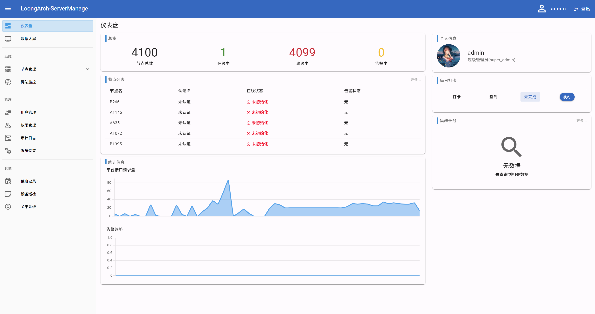
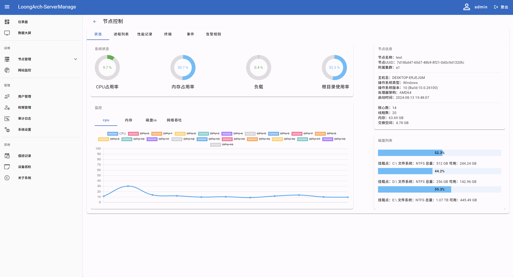
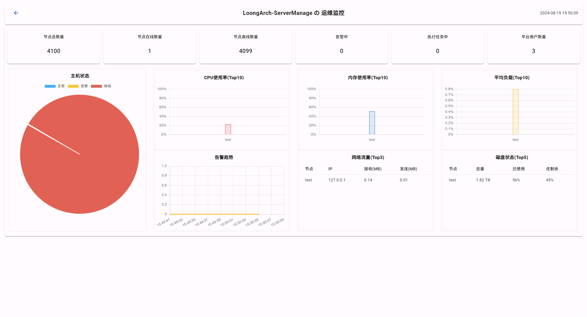

<P align="center"></P>

## 关于
ServerManager 是一款由Python编写的开源服务器集群管理系统及解决方案，支持LoongArch64、X86等平台，可在Windows与Linux上运行，您可以通过各种设备上的浏览器连接到管理平台，允许用户批量导入多个节点并通过权限控制，将不同节点按时段分配给指定用户

## 主要功能

**节点功能**
>- 节点管理
>  - 节点状态 （实时监控节点占用情况）
>  - 进程列表 （类似于任务管理器，可在WebUI直接管理进程运行情况）
>  - 性能记录 （根据设定时间，定时保存节点占用情况并记录）
>  - 节点终端 （SSH\CMD）
>  - 节点事件 （记录节点上发生的事件）
>  - 告警规则设置
>- 集群管理
>  - 集群编辑 （可快速给节点编组）
>  - 集群命令执行 （在集群内批量执行一些命令，并记录返回）
>  - 集群任务 （可在集群内根据‘指定时间’、‘周期’、‘间隔’方式执行一些命令，并记录返回）
>  - 集群文件分发 （可批量给节点发送文件）
>- 网站监控  

**管理功能:**
>- 用户管理
>- 权限管理
>- 审计日志
>- 系统设置  

**其他**
>- 值班记录
>- 设备巡检记录

## UI展示  




## 系统要求
|      |                要求                |
|:----:|:--------------------------------:|  
| CPU  | LoongArch64、X86平台，双核，1.5GHz以上处理器 |
|  内存  |              1G及以上               |
| 操作系统 |          Windows、Linux           |
| 存储空间 |           4G及以上（建议40G）           |


## 安装

### 使用自动安装脚本
```shell
    cd ServerManager-Panel
    sudo chmod +x setup.sh  # 给予安装脚本运行权限
    sudo ./setup.sh  # 开始安装
```

### 以Debug模式启动及调试项目
**拉取源码**

```shell
    # 克隆源码到本地
    git clone https://github.com/infinite-superstring/ServerManager-Panel.git
    cd ServerManager-Panel
    # 初始化子模块
    git submodule init
    git submodule update
```

**启动前端服务器**

```shell
    # 进入UI项目文件夹
    cd web_develop
    # 安装NodeJs依赖
    npm i
    # 运行开发服务器
    node run dev
```

**准备Python环境**

```shell
    # 回到上级目录
    cd ../
    # 新建虚拟环境
    python -m venv venv
    # 进入虚拟环境
    .\venv\Scripts\activate  # Windows
    source venv/bin/activate  # Linux
    # 安装依赖
    pip3 install -r requirements.txt
```

**初始化数据库**
```shell
    # 生成数据表
    python manage.py makemigrations
    # 创建数据库文件 
    python manage.py migrate
    # 初始化数据库数据
    python manage.py initial_data
    # ps: 忘记密码后可通过 python manage.py resetAdmin 重置密码
```

**运行后端服务器**

```shell
    python manage.py runserver 0.0.0.0:8000
```

## License
Copyright (c) 2023-2024 Infinite Superstring, All rights reserved.

Licensed under The GNU General Public License version 3 (GPLv3) (the "License"); you may not use this file except in compliance with the License. You may obtain a copy of the License at

https://www.gnu.org/licenses/gpl-3.0.html

Unless required by applicable law or agreed to in writing, software distributed under the License is distributed on an "AS IS" BASIS, WITHOUT WARRANTIES OR CONDITIONS OF ANY KIND, either express or implied. See the License for the specific language governing permissions and limitations under the License.
